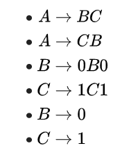
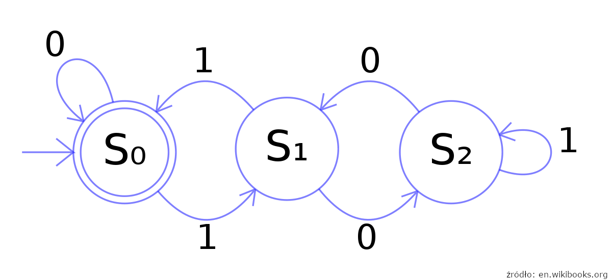
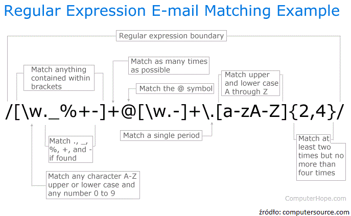
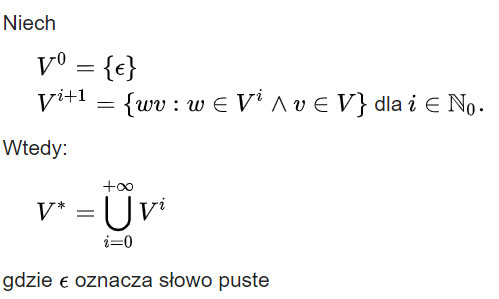
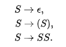
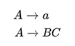
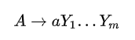
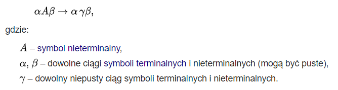
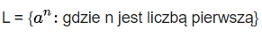

<!-- <link rel="stylesheet" href="css/theme/black.css" id="theme"> -->

# Hierarchia gramatyk formalnych

---

## Język formalny

podzbiór zbioru wszystkich słów nad skończonym alfabetem.

--

## Alfabet

dowolny skończony zbiór. Elementy alfabetu to litery. Przykładowe alfabety to:

- zbiór symboli ASCII
- {0, 1}

---

## Gramatyka formalna

---

## Hierarchia Chomsky’ego

--

- Regularne
- Bezkontekstowe
- Kontekstowe
- Rekurencyjnie przeliczalne

Note: This will only appear in the speaker notes window.

---

## Język regularny

to język formalny taki, że istnieje automat o skończonej liczbie stanów potrafiący zdecydować, czy dane słowo należy do języka.

Wszystkie języki regularne są bezkontekstowe.

--

--

## Wyrażenie regularne

--

Języki regularne są zamknięte na operacje:

- dopełnienia
- sumy
- przecięcia
- transpozycji
- konkatenacji
- domknięcia Kleene’ego

--

## Domknięcie Kleene’ego

dla zbioru V zapisuje się V\* i definuje rekurencyjnie

--

## Lemat o pompowaniu

Załóżmy, że dany język jest regularny. Wtedy istnieje taka stała n, że dla każdego słowa w należącego do tego języka i dłuższego niż n, możemy to słowo podzielić na trzy części xyz z czego n > |xy| i |y| > 0, i dla każdego k całkowitego nieujemnego, xykz należy do języka.

Note: {\displaystyle L=\{a^{m}b^{m}:m\in N\},}

---

## Język bezkontekstowy

to język formalny taki, że istnieje niedeterministyczny automat ze stosem decydujący czy dany łańcuch należy do języka.

--

## Język Dycka

Język „poprawnie rozstawionych nawiasów”

--

Języki regularne są zamknięte na operacje:

- sumy
- transpozycji
- konkatenacji
- domknięcia Kleene’ego
- przecięcia z językiem regularnym

--

## Postać normalna Chomsky’ego

--

## Postać normalna Greibach

--

## Lemat o pompowaniu

Dla każdego języka bezkontekstowego istnieje takie n, że każde słowo z tego języka długości większej od n można zapisać w postaci uvwxy, gdzie |vwx| < n, przynajmniej jedno z v i x jest niepuste, i dla każdego k, uvkwxky należy do tego języka.

Note: Lemat Ogdena

---

## Gramatyka kontekstowa

gramatyka formalna, której reguły są postaci:

--

Przykładem języka kontekstowego, który nie jest bezkontekstowy jest zbiór słów

--

Języki regularne są zamknięte na operacje:

- sumy
- przecięcia
- konkatenacji
- dopełnienia

---

